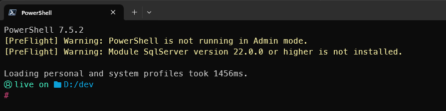

# PreFlight: Integration Test Framework for Your Local Pwsh Workspace

PreFlight helps with two common problems faced by development teams:

- **Inconsistent Tooling** – As developers onboard to a new team, their tooling will often reflect the project state at that time. PreFlight helps teams to identify inconsistencies between developer environments, and “Works on my Machine” scenarios.

- **Change Detection** – In larger organisations, unannounced changes (group policy, networks/proxies, toxicity initiatives etc.) can silently break environments. PreFlight can help to catch these breaking changes before they impact delivery.

---

## How It Works

- Deploys the pre-flight module to the user modules folder.
- Adds a call to your Pwsh `PROFILE` that imports the `PreFlight` module.
- Failed test notifications are then shown once per script session, when your terminal loads.

---

## Setup

- Run `PreflightSetup.ps1`.
- Deploys `PreFlight` to your local user modules folder.
- Backs up and updates your `PROFILE`.
- Opens a new Pwsh session to run tests.
- NOTE: Re-run the setup script after adding/editing tests to deploy updates. 

---

## Included Checks

### Enabled by default
- **Check Admin Mode** – Verifies if the session is elevated.
- **Check PowerShell Version** – Confirms it meets the minimum version.
- **Check Execution Policy** – Ensures policy is compatible.

### Require Configuration
- **Check Installed Modules** – Verifies required modules are present and up to date.
- **Check Installed Tools** – Verifies required tools are present and up to date.
- **Check Environment Variables** - Confirms the existence of required environment variables.
- **Check Public IP** - Verifies that your Public IP address matches the expected value.
- **Check Service Availability** - Verifies that critical services are reachable.

---

## Notes

- More tests = increased startup latency. Tests that rely on network access should be used sparingly and ensure a low timeout threshold.
- You may find that some of your test dependencies aren't available when the PROFILE is loaded. You can defer test execution by overriding the default Prompt function and running tests from there – assumes you don't already override it via OMP etc.
- PreFlight is intended to be a simple framework. Included tests are for reference only. PreFlight isn't opinionated about the correct way to test your environment or which tests should be important to your team.

